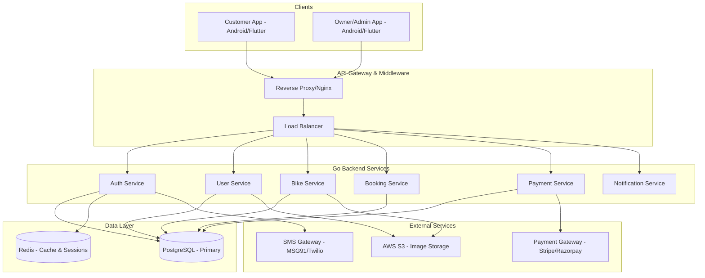

# Bike Rental Platform Architecture

## 1. Overall System Architecture



## 2. Repository Structure

**Recommendation: Monorepo**
A monorepo approach is recommended for a startup or mid-sized commercial platform to ensure consistency across API contracts, shared DTOs (if applicable), and unified CI/CD pipelines.

```text
bike-rental-platform/
├── app/                    # Current Android Native/Compose App (Customer & Owner)
├── apps/                   # (Future) customer_app & owner_app (Flutter)
├── backend/                # Go Backend Services
├── docs/                   # System Architecture & ERDs
├── infrastructure/         # Terraform/K8s/Docker configurations
├── database/               # DB Seeders and Standalone migration scripts
└── scripts/                # CI/CD and automation scripts
```

## 3. Client Architecture (Flutter / Android)
Following Clean Architecture with MVVM for presentation.

*   **presentation/**: UI Screens and ViewModels.
*   **domain/**: Business logic, Entities, Use Cases.
*   **data/**: Repositories, Data Sources (Remote/Local), DTOs.
*   **core/**: Error handling, Network interceptors, Constants.
*   **routing/**: Navigation definitions and deep links.
*   **services/**: Background tasks, FCM, Location.
*   **theme/**: Colors, Typography, Shapes.

## 4. Go Backend Architecture
Using Clean Architecture adapted for Go (Standard Project Layout).

*   **cmd/**: Main applications (e.g., `cmd/api/main.go`).
*   **internal/**: Private application and library code.
    *   **domain/**: Enterprise business rules, entities, and interfaces.
    *   **application/**: Use cases (services) implementing business rules.
    *   **repository/**: Database implementations of domain interfaces.
    *   **handler/**: HTTP/Fiber handlers for request/response parsing.
    *   **middleware/**: Auth, Logging, CORS, Rate Limiting.
*   **pkg/**: Public library code safe to use by external applications.
*   **config/**: Configuration management (Viper/Env).
*   **migrations/**: golang-migrate SQL files.
*   **docs/**: Swagger generated docs.

## 5. Coding & Security Standards
*   **Security**: JWT for Stateless Auth, Argon2id/Bcrypt for Password Hashing, Rate limiting per IP/User, SQL Injection prevention via GORM/Parameterized queries, CORS strictly bound to known origins.
*   **Development**: Trunk-based development, Semantic Commit Messages, PRs require 1 approval + CI passing (Lint, Tests, Build).
