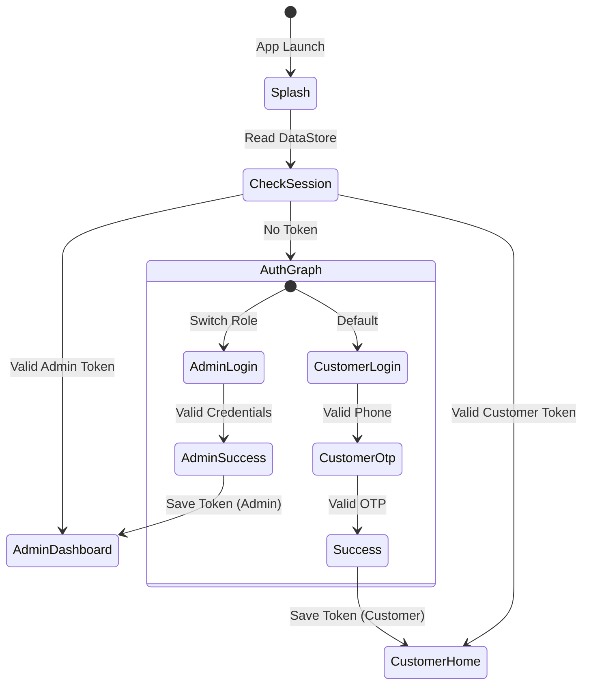

# Authentication Flow & Session Management

## Overview
The authentication module manages isolated login experiences for both **Customers** (Phone/OTP) and **Admins** (Email/Password). State is managed via `StateFlow` in ViewModels and persisted in local storage using `DataStore`.

## State Diagram

## Session Lifecycle
Sessions are stored using `Preferences DataStore` in `core/storage/SessionManager.kt`. 
- **`isLoggedIn`**: Boolean flag.
- **`userRole`**: String enum representing `CUSTOMER` or `ADMIN`.
- **`authToken`**: Bearer token (currently mocked).

When a user logs out, `SessionManager.clearSession()` is called, which wipes the DataStore. Navigation routes automatically observe `isLoggedIn` and will force the user back to `auth_graph` if the session is cleared.

## Mock Repository Guide
Currently, `MockAuthRepository.kt` simulates all backend logic.
- **OTP Validation:** Hardcoded to accept `1234` or `000000`.
- **Admin Validation:** Hardcoded to accept `admin@bikerental.in` with password `Password123`.

## Future Backend Integration
To replace the mock logic with real APIs:
1. Create a `RetrofitAuthService` interface with `@POST` endpoints for `/api/auth/send-otp` and `/api/auth/verify-otp`.
2. Update the Hilt module to bind `AuthRepositoryImpl` instead of `MockAuthRepository`.
3. The UI layer and ViewModels will remain exactly the same as they depend on the `Result<T>` wrapper, ensuring zero friction during backend integration.
