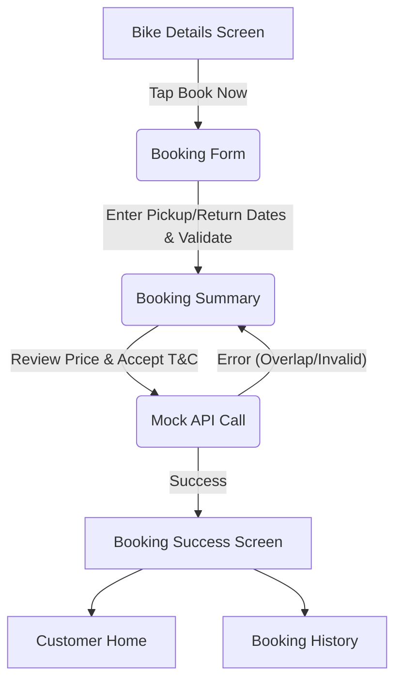

# Booking Engine Architecture

## Module Overview
The Booking Engine handles the entire lifecycle of a rental—from the initial date selection by the customer to final status tracking (e.g., Active, Completed, Cancelled). It utilizes Jetpack Compose for all UI flows, Hilt for dependency injection, and a comprehensive Mock Repository to simulate complex backend constraints.

## Booking Flow Diagram

## State Management
State is managed across several highly decoupled ViewModels:
- **`BookingCreateViewModel`**: Manages the transient state of creating a new booking. It holds `pickupDate`, `returnDate`, and computes the total pricing before persisting it via the `MockBookingRepositoryImpl`.
- **`BookingHistoryViewModel`**: Manages the list of the user's historical bookings, exposing a `selectedTab` state to seamlessly filter the master list into Upcoming, Active, Completed, and Cancelled categories without requiring redundant network calls.
- **`BookingDetailsViewModel`**: Fetches an isolated booking by UUID and exposes cancellation capabilities if the booking status is `PENDING_APPROVAL`.

## Business & Validation Rules
The mock repository currently implements the following strict rules:
1. **Date Validation**: `pickupDate` and `returnDate` must not be blank.
2. **Availability Check**: The mock logic ensures a bike cannot be double-booked by checking for overlapping dates in existing active or approved mock bookings.
3. **ID Generation**: A human-readable Booking ID is generated sequentially starting with the prefix `BK2026` (e.g., `BK202600001`).

## Future Backend Integration Mapping
When preparing for a production backend launch:
1. Implement `ApiBookingRepositoryImpl`.
2. Map the `createBooking` method to a `POST /api/bookings` endpoint, converting the UI Date format (DD/MM/YYYY) into strict ISO-8601 strings.
3. Ensure backend validation mirrors the existing `MockBookingRepositoryImpl` to catch latency-based double bookings.
