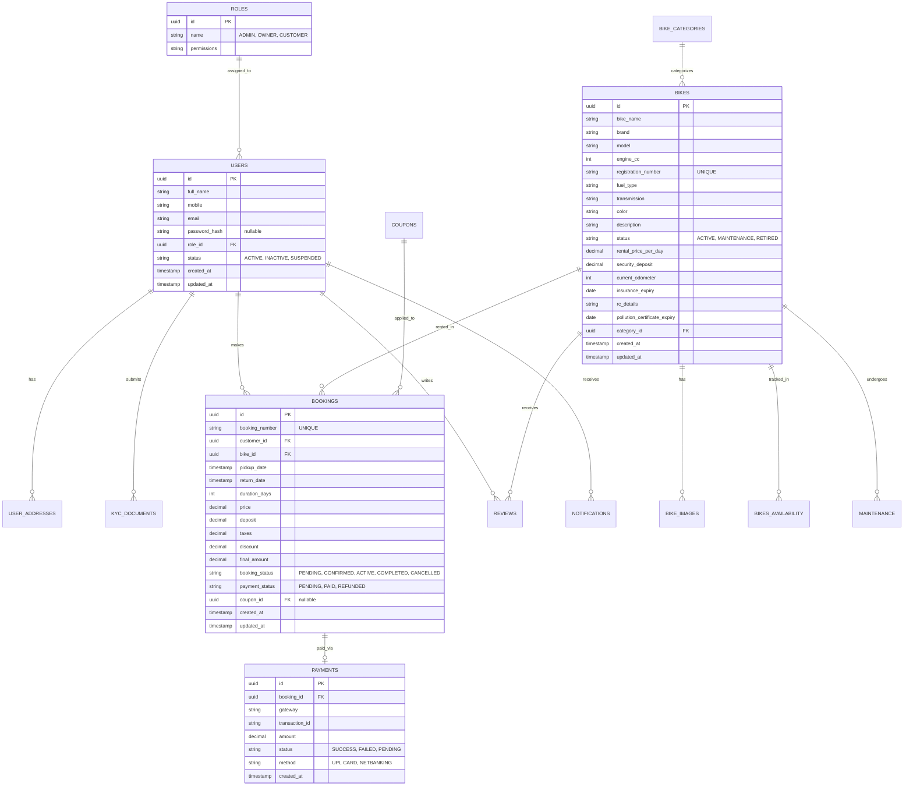

# Database Architecture & ERD

## Entity Relationship Diagram (PostgreSQL)

## Normalization & Performance
*   **UUIDs**: All tables use UUIDv4 for Primary Keys.
*   **Indexes**: 
    *   B-Tree Indexes on `mobile` and `email` in `USERS`.
    *   B-Tree Index on `booking_number` in `BOOKINGS`.
    *   Composite Indexes on `(bike_id, pickup_date, return_date)` for fast availability checking.
*   **Soft Deletes**: Implemented via `deleted_at` timestamp on Users and Bikes.
*   **Cascading**: 
    *   `RESTRICT` on deleting a user with active bookings.
    *   `CASCADE` on deleting a user's session/OTP records.
